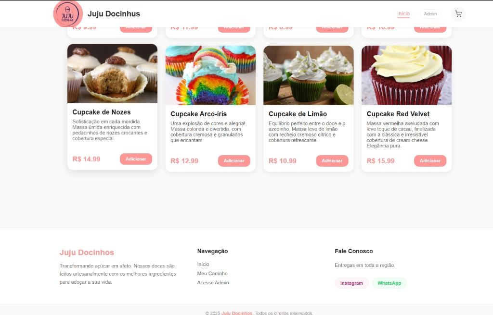
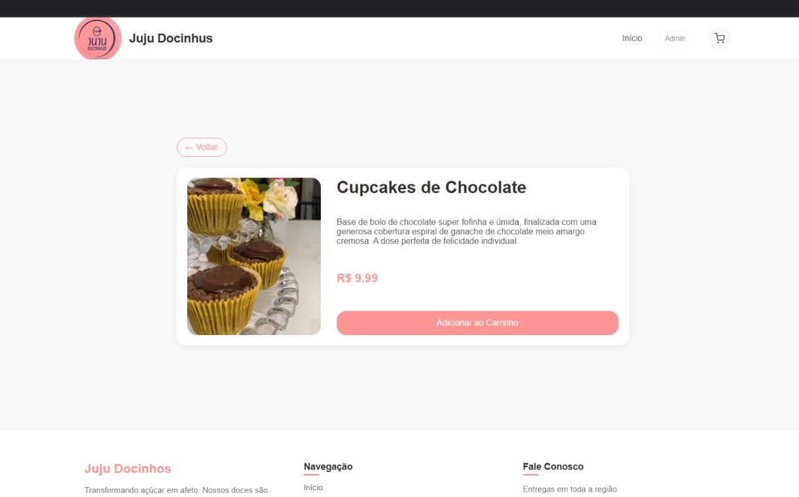
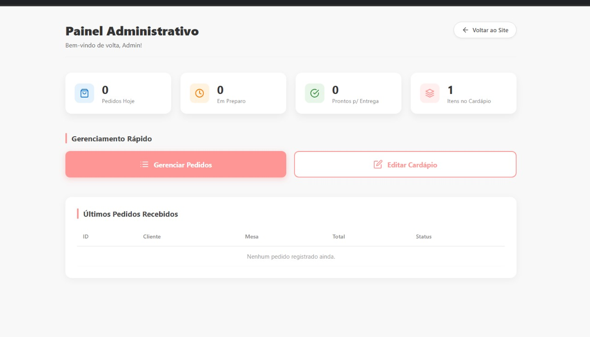
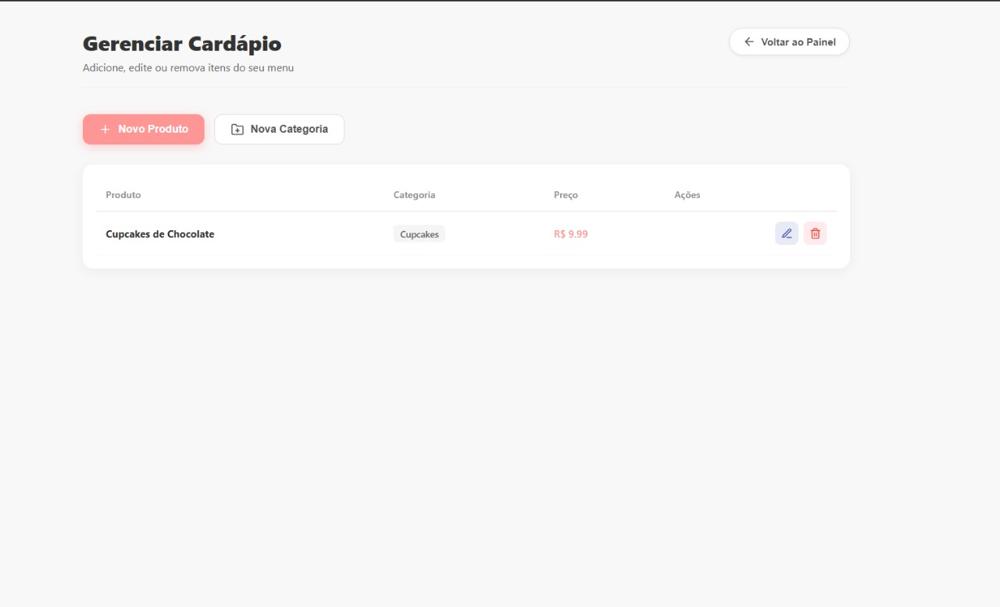

  
  <h1>🧁 Juju Docinhus</h1>
  
Uma plataforma moderna de autoatendimento gastronômico com arquitetura distribuída.

  
  
  
  

 

## 📋 Sobre o Projeto

O **Juju Docinhus** nasceu para modernizar e otimizar o fluxo de pedidos de um estabelecimento gastronômico. Muito além de um simples site, o projeto foi arquitetado como um **Ecossistema Completo**, substituindo processos manuais por uma solução digital rápida, segura e multiplataforma.

> **📱 Conheça também o App Mobile!**
> Esta aplicação Web compartilha a mesma API robusta com um aplicativo nativo desenvolvido em **Flutter**. 
> 👉 [Acesse o repositório do Aplicativo Mobile aqui](https://github.com/thiagosiena/juju-docinhus-app)

---

## 🚀 Arquitetura e Funcionalidades

O sistema foi dividido em módulos com responsabilidades claras e rotas protegidas:

### 🛒 Módulo Cliente (Web & Mobile)
- **Catálogo Dinâmico:** Navegação fluida e responsiva por categorias.
- **Carrinho Inteligente:** Cálculo de subtotal em tempo real e persistência de dados.
- **Autenticação:** Sistema de Login, Cadastro e Recuperação de Senha integrado ao **Firebase Auth**.
- **Checkout Seguro:** Envio de pedidos atrelados à conta do usuário com identificação de mesa.

### 💼 Módulo Lojista (Painel Administrativo)
- **Dashboard Estratégico:** Visão geral em tempo real de faturamento, pedidos do dia e status da cozinha.
- **Gestão de Cardápio:** CRUD completo (Criar, Ler, Atualizar e Deletar) de produtos e categorias.
- **Kanban de Pedidos:** Fluxo de preparo dinâmico (*Recebido → Em Preparo → Pronto → Entregue*).
- **Segurança:** Autenticação fechada via **JWT (JSON Web Tokens)** direta com a API Python.

---

## 📸 Telas da Aplicação Web

<table align="center">
  <tr>
    <td align="center">
      
       <b>Início / Cardápio</b>
    </td>
    <td align="center">
      
       <b>Detalhes do Produto</b>
    </td>
  </tr>
  <tr>
    <td align="center">
      
       <b>Dashboard Administrativo</b>
    </td>
    <td align="center">
      
       <b>Gerenciamento de Cardápio</b>
    </td>
  </tr>
</table>

---

## 🛠️ Stack Tecnológica

**Frontend (Web)**
* `React.js` (Vite) para SPA de alta performance.
* `React Router DOM` com sistema de Guardiões (Protected Routes) isolando Cliente e Admin.
* `Context API` para gerência de estado (Carrinho, Autenticação, Toasts).
* Autenticação via `Firebase`.
* Estilização minimalista e responsiva em `CSS Puro`.

**Backend (API Restful)**
* `Python` + `FastAPI`.
* Banco de dados `SQLite` com ORM `SQLAlchemy`.
* Segurança via OAuth2 com `JWT Bearer`.

---

## 🎓 Contexto Acadêmico

Este ecossistema foi projetado e desenvolvido de ponta a ponta (Full-Stack) como requisito de avaliação prática para os cursos de **Engenharia de Computação** da **Universidade de Ribeirão Preto (UNAERP)**.

* **Prática Extensionista VII:** Desenvolvimento da Plataforma Web (React) e Arquitetura da API.
* **Prática Extensionista VIII:** Integração do Aplicativo Mobile (Flutter).
* **Desenvolvedor Full-Stack:** Thiago Siena
* **Professor Orientador:** Rodrigo de Oliveira Plotze

 

  Desenvolvido com 💖 e muita cafeína.

