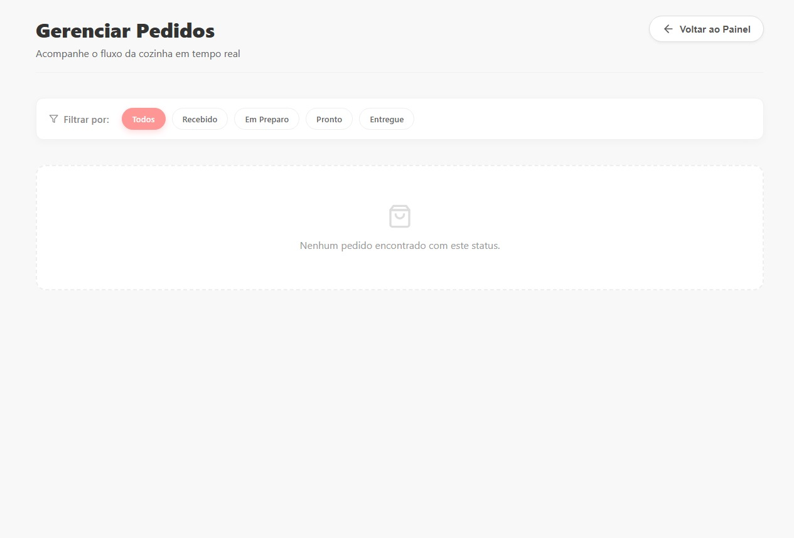

# 🧁 Juju Docinhus - Cardápio Digital

Este projeto é uma aplicação web distribuída desenvolvida como parte da disciplina **Prática Extensionista VII**. O sistema consiste em um Cardápio Digital que permite aos clientes realizarem pedidos de forma autônoma e um Painel Administrativo para gestão de produtos e acompanhamento de pedidos em tempo real.

## 📋 Sobre o Projeto

O objetivo foi informatizar o processo de pedidos da **Juju Docinhus**, substituindo o cardápio físico e o bloco de notas por uma solução digital integrada. A aplicação segue a arquitetura cliente-servidor e utiliza comunicação via API REST.

---

## 📸 Telas do Sistema

### Módulo Cliente (Frontend)

**Tela Inicial (Cardápio)**

*Visualização de produtos por categoria*

**Detalhes do Produto**

*Detalhes, preço e adição ao carrinho*

### Módulo Administrativo (Backoffice)

**Dashboard Geral**

*Visão geral de métricas e status*

**Gerenciar Cardápio**

*CRUD de Produtos e Categorias*

**Gerenciar Pedidos**

*Fluxo de pedidos (Kanban)*

---

## 🎥 Vídeo de Apresentação

Confira a demonstração completa do funcionamento da aplicação (Cliente e Admin) no vídeo abaixo:

[Clique aqui para assistir](SEU_LINK_DO_VIDEO_AQUI)

---

## 🚀 Funcionalidades

### Módulo Cliente (Frontend)
* **Visualização de Cardápio:** Navegação fluida por categorias (Bolos, Bebidas, etc.).
* **Detalhes do Produto:** Visualização de fotos ampliadas, descrição e preço.
* **Carrinho de Compras:** Adição/remoção de itens e cálculo automático de subtotal.
* **Checkout:** Envio de pedido com identificação do cliente e mesa.

### Módulo Administrativo (Backoffice)
* **Dashboard:** Visão geral com métricas diárias (pedidos hoje, em preparo, faturamento).
* **Gestão de Cardápio (CRUD):** Adicionar, editar e remover produtos e categorias com upload de imagens.
* **Gestão de Pedidos:** Acompanhamento em tempo real com mudança de status (Recebido → Em Preparo → Pronto → Entregue).
* **Autenticação:** Sistema de login seguro para administradores.

---

## 🛠️ Tecnologias Utilizadas

O projeto foi desenvolvido utilizando uma stack moderna e performática:

### Frontend
* **React.js (Vite):** Para construção da interface reativa e SPA (Single Page Application).
* **Context API:** Para gerenciamento de estado global (Carrinho, Autenticação, Toasts).
* **CSS Modules:** Estilização responsiva e organizada.
* **React Icons:** Ícones vetoriais para interface rica.

### Backend
* **Python (FastAPI):** Framework de alta performance para construção da API REST.
* **SQLAlchemy:** ORM para manipulação eficiente do banco de dados.
* **SQLite:** Banco de dados relacional (arquivo `sql_app.db`).
* **Pydantic:** Validação de dados e schemas.

---

## ⚙️ Como Executar o Projeto

### Pré-requisitos
* Node.js (v16+)
* Python (v3.10+)

### 1. Executando o Backend (API)

```bash
cd backend

# Crie um ambiente virtual (opcional, mas recomendado)
python -m venv venv

# Windows:
venv\Scripts\activate
# Linux/Mac:
source venv/bin/activate

# Instale as dependências
pip install -r requirements.txt

# Inicie o servidor
uvicorn app.main:app --reload

```


API estará rodando em: http://127.0.0.1:8000 Documentação Swagger: http://127.0.0.1:8000/docs

### 2. Executando o Frontend (Cliente Web)

Abra um novo terminal na raiz do projeto:

```Bash

# Instale as dependências
npm install

# Inicie o servidor de desenvolvimento
npm run dev
```
O projeto estará disponível em: http://localhost:5173

Desenvolvido com 💖